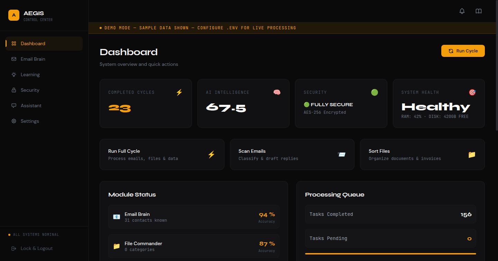
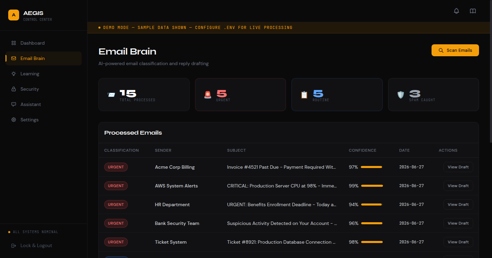
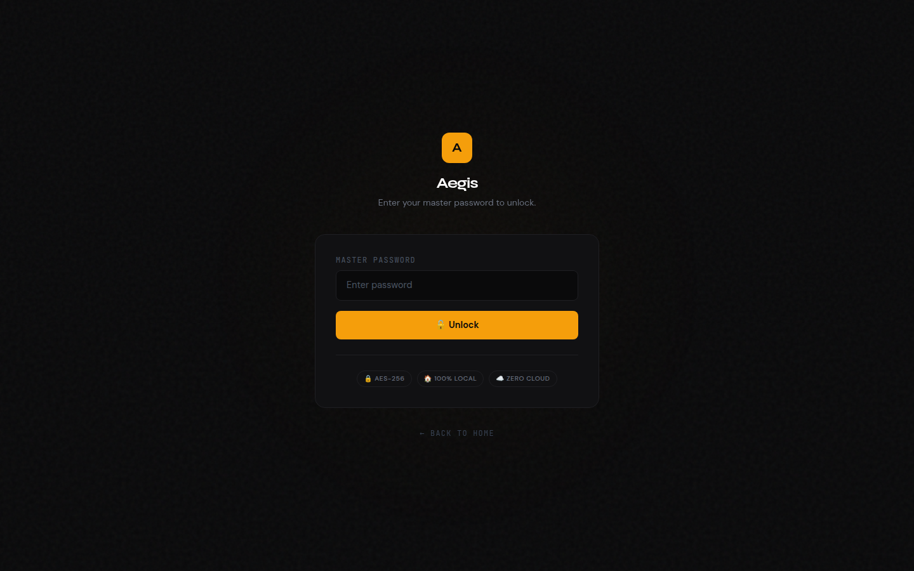
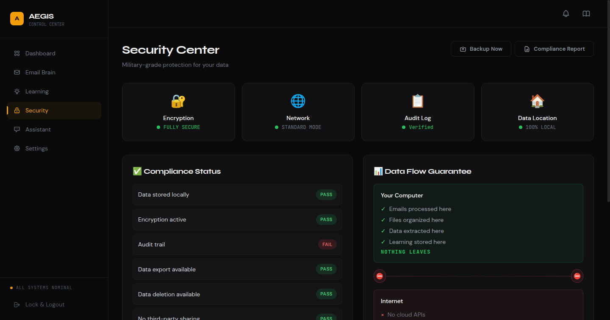
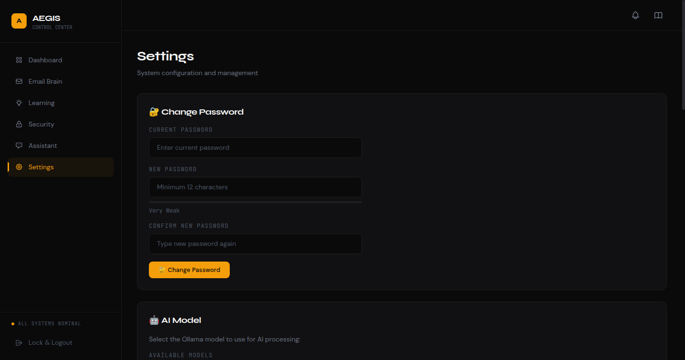
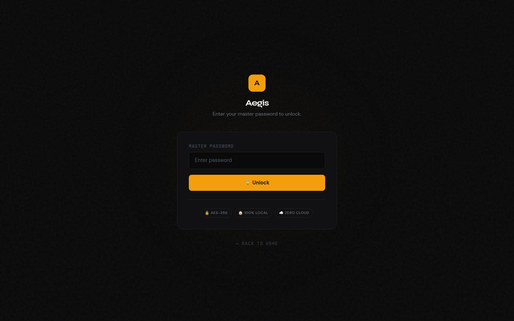
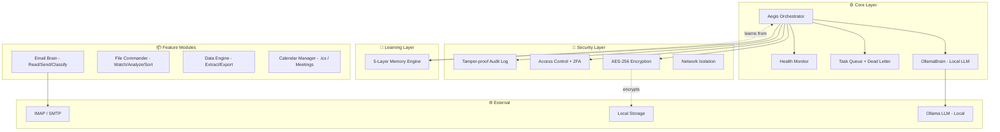

<div align="center">

# ⚡ Aegis

**Your Private AI Assistant for Email, Files & Data**

*Works silently. Learns constantly. Never phones home.*

<br/>

[](https://github.com/ravikumarve/Aegis/releases)
[](https://python.org)
[](https://github.com/ravikumarve/Aegis/tree/main/Tests)
[](LICENSE)
[](https://hub.docker.com)
[](#)

<br/>

```
   █████╗ ███████╗ ██████╗ ██╗███████╗
  ██╔══██╗██╔════╝██╔════╝ ██║██╔════╝
  ███████║█████╗  ██║  ███╗██║███████╗
  ██╔══██║██╔══╝  ██║   ██║██║╚════██║
  ██║  ██║███████╗╚██████╔╝██║███████║
  ╚═╝  ╚═╝╚══════╝ ╚═════╝ ╚═╝╚══════╝
```

<br/>

[**Get Started →**](#-quick-start) &nbsp;·&nbsp; [**Screenshots**](#-screenshots) &nbsp;·&nbsp; [**Features**](#-key-features) &nbsp;·&nbsp; [**Documentation**](#-documentation)

---

</div>

## 🚀 Quick Start

### Prerequisites

- Python 3.8+
- [Ollama](https://ollama.ai) installed and running
- 4GB+ RAM recommended

### One-Line Install

```bash
git clone https://github.com/ravikumarve/Aegis.git
cd Aegis
python3 -m venv venv && source venv/bin/activate
pip install -r requirements.txt
ollama pull phi3:mini
cp .env.example .env
python3 setup.py
```

Then access the dashboard at **http://localhost:5000**.

### Docker

```bash
docker-compose up -d
# Dashboard at http://localhost:5000
```

---

## 📸 Screenshots

<div align="center">

| | |
|:---:|:---:|
| **Dashboard** | **Email Brain** |
|  |  |
| **Learning** | **Security** |
|  |  |
| **Settings** | **Assistant** |
|  |  |

</div>

---

## ✨ Key Features

### 📧 Email Automation
- IMAP/SMTP integration — works with Gmail, Outlook, ProtonMail, and any standard email
- AI-powered classification: `URGENT` · `ROUTINE` · `SPAM` · `MEETING`
- Smart reply drafting that **learns your writing style**
- Contact prioritization and relationship tracking
- Customizable email templates system

### 📁 File Management
- Folder watcher with real-time AI content analysis
- Automatic organization into smart categories
- Duplicate detection and cleanup suggestions
- Deep content understanding — not just filenames

### 📊 Data Entry & Extraction
- Invoice and receipt parsing with OCR
- Export directly to Excel, CSV, or Google Sheets
- Batch processing for entire document folders
- Learns your naming conventions and data formats

### 🧠 5-Layer Self-Learning Memory
```
Layer 1 │ Feedback Loop      ── Learns from every correction you make
Layer 2 │ Preference Capture ── Stores your working style and habits  
Layer 3 │ Style Learning     ── Mimics your email tone and voice
Layer 4 │ Pattern Recognition── Detects time-based behavioral patterns
Layer 5 │ Predictions        ── Anticipates your next action
```

### 🔒 Enterprise Security
- AES-256 Fernet encryption with PBKDF2 key derivation (600K iterations)
- TOTP 2FA support
- Network isolation modes: `normal` · `isolated` · `air-gapped`
- Tamper-proof audit log with hash chain
- IP allowlisting and rate limiting

### 🌐 Web Dashboard
- Beautiful dark-themed monitoring UI
- Real-time task queue visibility
- System health and Ollama status monitoring
- Notification bell with real-time alerts
- First-run setup wizard with 4-step guided configuration
- AI Assistant chat interface with system context awareness
- Prometheus + Grafana integration

---

## 🏗️ Architecture



---

## 🆚 Why Aegis?

<div align="center">

| | Aegis | Zapier / Make | Microsoft Copilot | Notion AI |
|--|:-----------:|:-------------:|:-----------------:|:---------:|
| **100% Local** | ✅ | ❌ | ❌ | ❌ |
| **No Subscription** | ✅ | ❌ | ❌ | ❌ |
| **Your Data Stays Private** | ✅ | ❌ | ❌ | ❌ |
| **Learns Your Style** | ✅ | ❌ | ⚠️ | ⚠️ |
| **Works Offline** | ✅ | ❌ | ❌ | ❌ |
| **GDPR / HIPAA Ready** | ✅ | ⚠️ | ⚠️ | ❌ |
| **Open Source** | ✅ | ❌ | ❌ | ❌ |

</div>

---

## 🔐 Security

Aegis is built with a security-first mindset. Every byte of sensitive data is protected.

### Encryption
| Layer | Method | Detail |
|-------|--------|--------|
| Data at rest | AES-256 Fernet | Industry-standard symmetric encryption |
| Key derivation | PBKDF2-HMAC-SHA256 | 600,000 iterations — brute force resistant |
| Master password | Never stored | Derived at runtime, wiped from memory |
| File deletion | 3-pass overwrite | DoD-standard secure deletion |

### Authentication
- ✅ Master password with strength enforcement
- ✅ TOTP 2FA (Google Authenticator, Authy)
- ✅ Session tokens with automatic refresh and expiry
- ✅ CSRF protection on all forms

### Network Security
- ✅ IP allowlisting
- ✅ Configurable rate limiting
- ✅ Network isolation modes: `normal` · `isolated` · `air-gapped`

### Compliance
- ✅ GDPR Article 17 & 20 (right to erasure, data portability)
- ✅ HIPAA-ready audit trail
- ✅ Tamper-proof hash chain logging
- ✅ Full data export and secure deletion

---

## 📖 Documentation

| Document | Description |
|----------|-------------|
| [README.md](README.md) | Overview and quick start (you are here) |
| [ARCHITECTURE.md](ARCHITECTURE.md) | Detailed system design and module breakdown |
| [docs/DEPLOYMENT.md](docs/DEPLOYMENT.md) | Local, Docker, and production deployment guide |
| [docs/API.md](docs/API.md) | REST API reference |

---

## 🛠️ Development

### Project Structure

```
aegis/
├── main.py                     # Entry point + CLI menu
├── setup.py                    # First-run setup wizard
├── core/                       # Orchestration layer
│   ├── pilot.py               # Main Aegis class
│   ├── config.py              # Configuration manager
│   ├── ollama_brain.py        # Local LLM interface
│   ├── queue_manager.py       # Task queue + dead letter
│   ├── health_monitor.py      # System health checks
│   ├── retry.py               # Exponential backoff
│   ├── metrics.py             # Prometheus metrics
│   └── demo_data.py           # Demo mode sample data
├── security/                   # Security layer
│   ├── encryption.py          # AES-256 engine
│   ├── auth.py                # Access control
│   ├── audit.py               # Audit logging
│   ├── session.py             # Session management
│   ├── network.py             # Network isolation
│   └── compliance.py          # GDPR/HIPAA compliance
├── learning/                   # Self-learning engine
│   └── memory.py              # 5-layer memory system
├── modules/                    # Feature modules
│   ├── email_brain/           # Email read/send/classify
│   ├── file_commander/        # Watch/analyze/sort files
│   ├── data_engine/           # Extract/export data
│   └── calendar/              # Calendar + meetings
├── dashboard/                  # Flask web dashboard
│   ├── app.py                 # Flask routes + API
│   ├── notifications.py       # SQLite notification storage
│   └── templates/             # HTML templates
├── Tests/                      # Test suite
├── docs/                       # Documentation & screenshots
└── .env.example                # Config template
```

### Running Tests

```bash
pytest Tests/                          # All tests
pytest Tests/ --cov=. --cov-report=term-missing  # With coverage
```

### Code Style

```bash
ruff format .         # Format code
ruff check .          # Lint
```

---

## 🐳 Docker

```bash
# Build and run
docker build -t aegis .
docker run -d --name aegis -p 5000:5000 aegis

# Or with docker-compose (includes Ollama)
docker-compose up -d
```

---

## 📄 License

MIT License — see [LICENSE](LICENSE) for details. Free to use, modify, and distribute.

---

<div align="center">

**Built with ❤️ for privacy-focused productivity**

*Aegis — your AI assistant that runs entirely on your machine*

<br/>

[](https://github.com/ravikumarve/Aegis/stargazers)
[](https://github.com/ravikumarve/Aegis/fork)
[](https://github.com/ravikumarve/Aegis/issues)

<br/>

© 2024–2026 Aegis · [MIT License](LICENSE)

</div>
